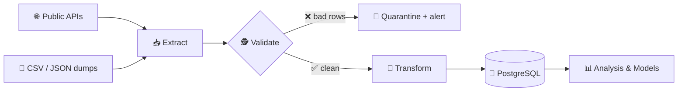

<div align="center">

```
        ┌───────────┐      ┌───────────┐      ┌───────────┐
 raw ──▶│  EXTRACT  │─────▶│ TRANSFORM │─────▶│   LOAD    │──▶ insight
 mess   └───────────┘      └───────────┘      └───────────┘     📊
```

# Hi, I'm Shila 👋

### 🧮 Applied Mathematician → 🛠️ Data Engineer

*I turn chaotic, half-broken, real-world data into pipelines that don't wake anyone up at 3 AM.*


</div>

---

## 🧬 `SELECT * FROM shila;`

```python
class Shila:
    def __init__(self):
        self.role        = "Junior Data Engineer"
        self.location    = "Tehran, Iran 🇮🇷"
        self.education   = "M.Sc. Numerical Analysis (Biomathematics) — GPA 4.0/4.0"
        self.background  = "Applied Math + Scientific Computing"
        self.published   = 5   # journal & conference papers 📄
        self.currently   = "building batch pipelines & learning orchestration"
        self.fun_fact    = "I taught neural networks to obey differential equations."

    def daily_routine(self):
        while True:
            self.ingest()      # 🌊 messy sources, inconsistent schemas
            self.validate()    # 🕵️ catch bad rows before they catch me
            self.transform()   # 🧪 clean, normalize, reshape
            self.load()        # 🗄️ into PostgreSQL
            self.coffee()      # ☕ non-optional dependency
```

---

## ⚙️ Tech Stack

**🐍 Languages**


**🗄️ Data & Storage**


**🤖 Modeling**


**🧰 Tools**


**🌱 Currently leveling up**


---

## 🚰 What a pipeline looks like in my head



---

## 🔬 Things I've Built

| Project | What it does | Stack |
|---|---|---|
| 🦠 **Multi-Source Epi Pipeline** | Ingests time-series from several public sources with clashing schemas → one clean, reproducible dataset | `Python` `pandas` `PostgreSQL` |
| 🔁 **Batch Experiment Runner** | Parameterized workflow that runs, logs & compares hundreds of model configs, exports structured results | `Python` `NumPy` |
| 🕸️ **Graph Data Processing** | Loads, batches & splits graph-structured datasets — adjacency, node features, train/test | `PyTorch` `NumPy` |
| 🧠 **PINN + Symbolic Regression** | Recovers *interpretable* governing equations from noisy epidemic data 📄 *published* | `PyTorch` `gplearn` |
| 🔢 **Digit Recognition via SVD** | Classification through pure linear algebra — no neural nets harmed | `NumPy` |

---

## 📄 Published Research

> **Rezvani, S.**, Abbaszadeh, M., & Dehghan, M. (2026).
> *Integrating physics-informed neural networks and symbolic regression for COVID-19 modeling.*
> **Computer Methods in Biomechanics and Biomedical Engineering**

Plus 4 more journal & conference papers on data-driven epidemic modeling 🧫

---

## 📈 GitHub Stats

<div align="center">


<br/>


</div>

---

## 🎯 What I'm looking for

Junior **Data Engineering** roles where I get to build the boring, unglamorous, absolutely-critical plumbing that everything else depends on. 🔧

I'm the person who reads the schema docs before writing the query.

---

## 📬 Reach me

<div align="center">

[](mailto:shila.rezvani.alishah@gmail.com)
[](https://www.linkedin.com/in/shila-rezvani)

<br/><br/>

```sql
SELECT 'thanks for scrolling' AS message,
       '☕' AS fuel,
       COUNT(*) AS bugs_fixed_today
FROM life
WHERE motivation > 0;
```

*"In God we trust. All others must bring data."* — W. Edwards Deming 📊

</div>
